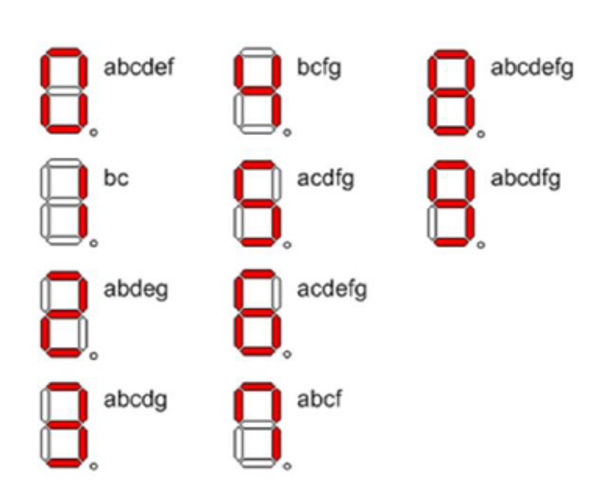
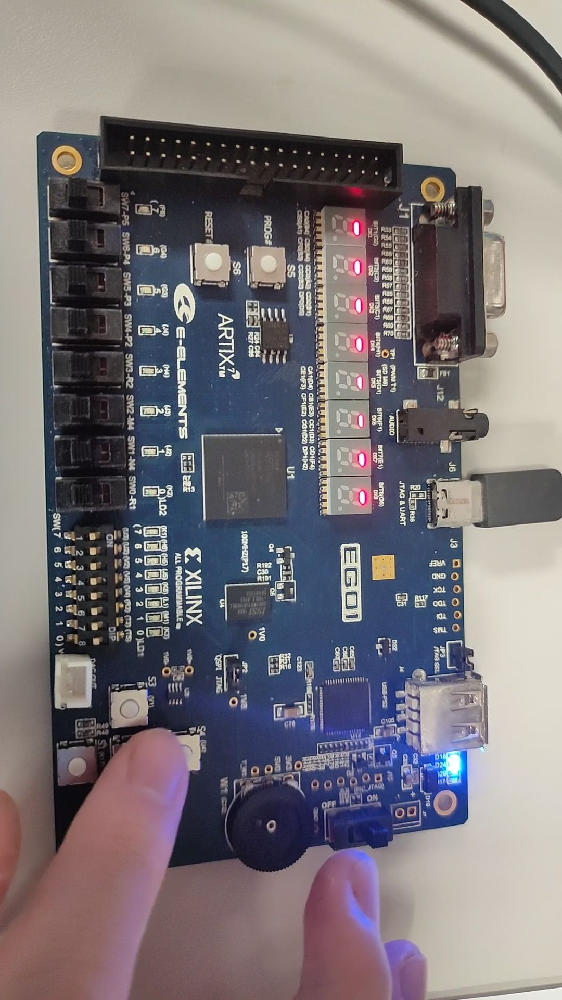
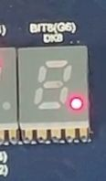
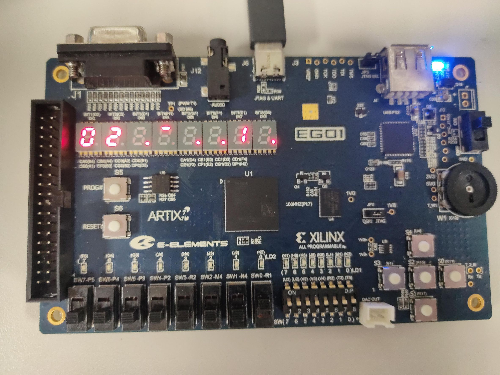
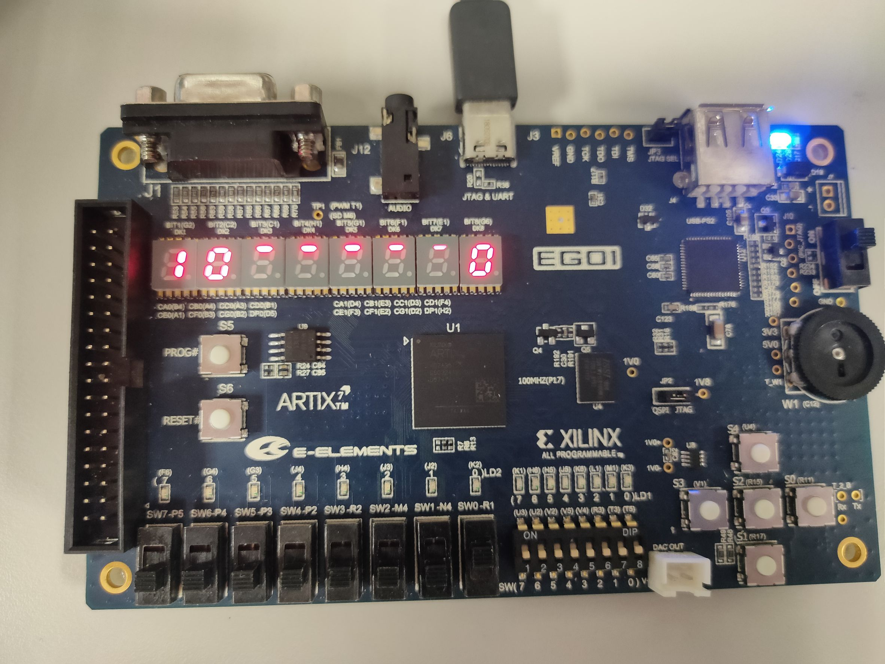
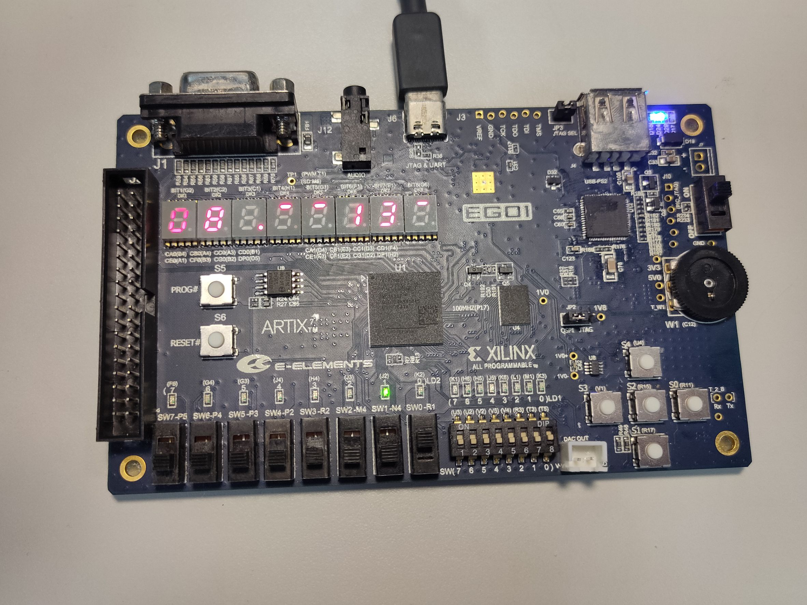
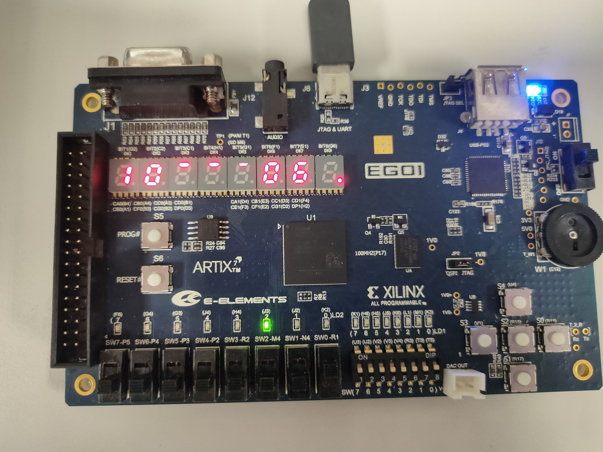
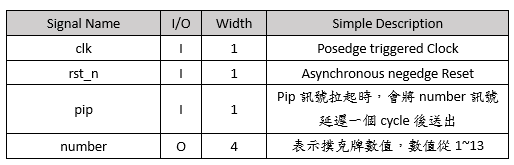
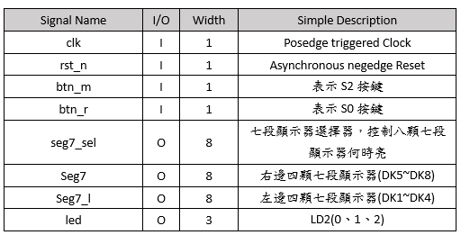

# 遊戲：十點半

## 目錄
- [遊戲介紹](#遊戲介紹)
- [Lab介紹](#本Lab遊戲玩法)
- [七段顯示器](#七段顯示器)
- [LED](#led)
- [檢查答案](#檢查答案)
- [評分標準](#評分標準)

## 需要使用工具
- 除頻器
- FSM
- LUT(會事先提供，作為抽撲克牌用)
- 3顆LED燈
- 兩顆七段顯示器

## 遊戲介紹:
十點半是撲克遊戲的一種。 經常被用來賭博。遊戲分為莊家與玩家，
玩家目標為拿到總點數合大於莊家拿到總點數合，反之則由莊家獲勝，點數均以不超過十點半為原則   
本Lab總共兩人玩，分別為玩家與莊家，點數大者即獲勝。  
起始玩家會拿到一張牌，拿到的牌會從1到13不等，其中1~10即代表對應的數值  
11、12、13則代表半點，累積兩個半點可以進位成一點  
玩家可以自行選擇要補牌與否，同理莊家，補牌上限為五張(包含起始的一張牌)    
遊戲決定勝負方式 
舉例: 玩家起始牌 : 3、莊家起始牌 : 9  
<範例1>
玩家補牌補到7，表示目前累積點數10，此時莊家如果不補牌，則由玩家獲勝  
<範例2>
玩家補牌補到5，表示目前累積點數8，此時莊家如果不補牌，則由莊家獲勝  
<範例3>
玩家補牌補到6，表示目前累積點數9，此時莊家如果不補牌，則由莊家獲勝(平手算莊家獲勝)  
<範例4>
玩家補牌補到6，表示目前累積點數9，此時莊家如果補到11，表示目前累積點數9.5，則由莊家獲勝  
<範例5>
玩家補牌補到6，表示目前累積點數9，此時莊家如果補到3，表示目前累積點數12，由於莊家點數超過10.5，判定玩家勝出  
<範例6>
玩家補牌補到3，又在補到6，表示目前累積點數12，此時莊家不論補到多少，均算莊家勝出  
為了簡化問題，本lab不考慮過五關的問題  

## 本Lab遊戲玩法
每回合從按下btn_m開始遊戲，按下後會進入抽牌階段

### 抽牌階段:
由玩家先抽一張牌，接著由莊家抽1張牌，抽牌需要使用LUT.v  
首先將此LUT instantiate進tenthirty.v，當需要抽牌時，拉起pip訊號，此時number訊號會延遲一個cycle後送出，此number訊號即表示抽到的牌。完成後即進入補牌階段，由玩家先開始補牌 

### 補牌階段:
同樣使用LUT.v補牌，方式同抽牌階段介紹 
按下btn_m即表示補牌，如果玩家決定不補牌，則按下btn_r表示換莊家補牌  
若玩家決定補牌，一旦補牌超過十點半，則會自動換莊家，在未超過十點半的情況下，玩家最多可以補四張牌  
同理莊家補牌階段，按下btn_m即表示補牌，按下btn_r表示進入比較大小階段 
一旦補牌超過十點半，則會自動換比較大小階段

### 比較大小階段:
- 以不超過10.半為原則，比對莊家與玩家的點數大小，點數大者獲勝
- 在莊家與玩家同點的情況下，判定莊家獲勝
- 玩家超過10.半的情況下，判定莊家獲勝

比大小完即為完成一個回合，按下btn_r即可開始下個回合  
遊戲一共進行四個回合，四個回合後狀態機須切換至DONE STATE

## 七段顯示器

七段顯示器顯示數值如下：

  

七段顯示器Reset後則顯示如下：

  

若抽到11、12、13，則顯示如下圖：

  

在玩家補牌階段，右邊5顆七段顯示器會由右往左顯示手牌資訊，最先出現的牌將顯示再最右邊，示意圖如下:

  

起始手牌為半點，接著補到1，再補到兩次半點，累加數值為2.5，總共補3張牌，總共四張牌  
左邊三顆七段顯示器則顯示累加數值，如上圖左三顆七段顯示器  
最左邊表十位數數值，中間表個位數，最右邊表示半點的情況，若無半點，則維持reset後情形，若有，則如上圖所示
    

若遇到手牌出現10的情形，則直接顯示0即可，示意圖如下圖最右邊的七段顯示器：

  

同理在莊家補牌階段，顯示莊家手牌與累計數值   

在比較大小階段，左三顆顯示莊家累積點數，右三顆顯示玩家累積點數，示意圖如下：

  

右三顆顯示方式與左三顆相同。最左邊表十位數數值，中間表個位數，最右邊表示半點的情況，若無半點，則維持reset後情形  

## LED
完成比大小後，需要亮起LED燈表示完成，亮燈規則如下  
led[0] : 玩家贏 ; led[1] : 莊家贏 ; 

  

上圖由於玩家補牌超過十點半，因此判定莊家獲勝，led[1]亮起   

led[2]則等四個回合均完成後拉起(即DONE STATE)，示意圖如下：

  

## Data Config
- LUT(look up table)

  

- TenThirty

  

示範影片如下:
https://www.youtube.com/watch?v=MHQ68WXCOEY&list=PLn0-Y9lYJqqvGrmoE9heed0lfZpIog0h0&index=1 

## 檢查答案

- Case 1 : Reset

  

- Case 2 : 顯示手牌資訊與累積點數
舉例：起始牌:半點，補牌補到1、半點、半點

  

- Case 3 : 顯示結果(包含LED燈亮起與玩家、莊家累積點數)
範例:如圖

  

- Case 4 : 四回合後led[2]是否亮起
範例:如圖

  

## 評分標準

1. Reset後七段顯示器符合標準(10分)
2. 每回合佔20分，共四回合佔80分  
- 成功顯示玩家手牌資訊與累積點數(5分)
- 成功顯示莊家手牌資訊與累積點數(5分)
- 成功顯示結果(包含LED燈亮起與玩家、莊家累積點數)(10分)
3. 四回合後led[2]是否亮起(10分)

